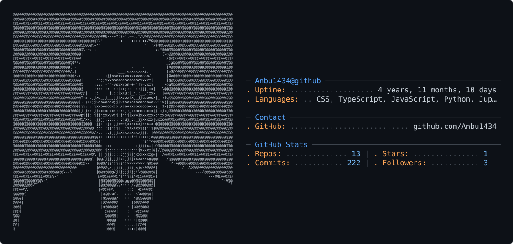

<picture>
  <source media="(prefers-color-scheme: dark)" srcset="dark_mode.svg" />
  <source media="(prefers-color-scheme: light)" srcset="light_mode.svg" />
  
</picture>

# Hi, I'm Anbu 👋

### Full-Stack Developer | UI/UX Designer | Freelancer

I'm a Computer Science Engineering student and full-stack developer passionate about building modern, scalable, and user-focused digital products.

I enjoy turning ideas into **web applications, SaaS products, business software, and intuitive user experiences**.

---

## 🚀 About Me

* 🎓 B.E. Computer Science & Engineering — 2026
* 💻 Full-Stack Developer
* 🎨 UI/UX Designer
* 🌐 Building websites, web apps & business software
* 🤖 Exploring AI-powered applications and automation
* 🚀 Founder & Developer at **TectFlow**
* 📍 Chennai, India

---

## 🛠️ Tech Stack

### Languages

`Python` `JavaScript` `TypeScript` `SQL` `C`

### Frontend

`React` `Next.js` `React Native` `Expo` `HTML5` `CSS3` `Tailwind CSS`

### Backend

`Node.js` `Express.js` `Django` `FastAPI`

### Databases

`PostgreSQL` `MySQL` `MongoDB` `Firebase` `SQLite` `Redis`

### Tools & Platforms

`Git` `GitHub` `Docker` `Postman` `Vercel` `AWS`

### AI & Development Tools

`Claude Code` `AI Agents` `LLM APIs` `n8n`

---

## 💼 Featured Projects

### 🏥 Hospital Management System

Production-ready desktop HMS for managing hospital operations.

**Tech:** Electron · Next.js · TypeScript · SQLite · Prisma

### 🩺 Clinic Management Platform

Modern clinic website with appointment management and an administrative dashboard.

**Tech:** Next.js · MongoDB · NextAuth.js · TypeScript · Vercel

### 📄 Document Deadline Management

Application for tracking documents, deadlines and automated alerts.

**Tech:** Django · REST API · React · PostgreSQL

### ✈️ AI Travel Planner

AI-powered travel planning application that generates personalized travel itineraries.

**Tech:** React · Python · AI APIs

---

## 📊 GitHub Stats

  
  

---

## 🔥 What I'm Currently Working On

* 🚀 Building and growing **TectFlow**
* 💻 Developing full-stack web applications
* 🤖 Exploring AI agents and automation
* 🎨 Improving UI/UX design skills
* 🌍 Working toward international freelance opportunities

---

## 🤝 Let's Connect

I'm open to:

* Freelance projects
* Web development collaborations
* UI/UX projects
* SaaS ideas
* AI-powered applications
* Business software development

### 📫 Connect With Me

---

  <b>💡 Building ideas into digital products.</b>

  ⭐ If you find my projects interesting, consider starring them!

